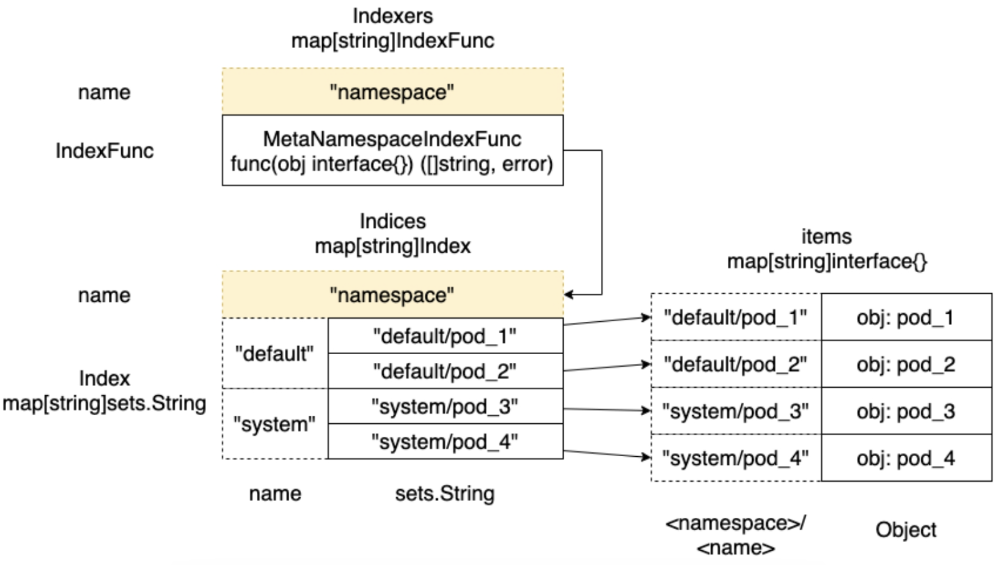

# 1. 介绍

indexer 是 client-go 中的缓存，不同于普通缓存，indexer 是带索引的缓存。

在 [client-go DeltaFIFO 精讲](./client-go%20DeltaFIFO%20精讲.md) 中介绍到 DeltaFIFO 
中的元素被加入到 threadSafeMap 中，这个 map 实际是 indexer 的一部分。

indexer 在 client-go 定义为接口，实现该 indexer 接口的是 cache 对象：
```aiignore
type Indexer interface {
	Store
	Index(indexName string, obj interface{}) ([]interface{}, error)
	IndexKeys(indexName, indexedValue string) ([]string, error)
	ListIndexFuncValues(indexName string) []string
	ByIndex(indexName, indexedValue string) ([]interface{}, error)
	GetIndexers() Indexers

	AddIndexers(newIndexers Indexers) error
}
```

cache 对象定义：
```aiignore
type cache struct {
	cacheStorage ThreadSafeStore
	keyFunc KeyFunc
}
```

其中，ThreadSafeStore 是线程安全存储的接口，KeyFunc 是返回对象 key 的函数，函数声明为 `type KeyFunc func(obj interface{}) (string, error)`

直接去看 indexer 做了什么比较绕，这里通过一个示例去熟悉。示例如下：
```aiignore
func main() {
        // 创建 index
	index := cache.NewIndexer(cache.MetaNamespaceKeyFunc, cache.Indexers{
		"namespace": cache.MetaNamespaceIndexFunc,
	})

        // 定义对象
	pod1 := &v1.Pod{ObjectMeta: metav1.ObjectMeta{Name: "one", Namespace: "default",
		Annotations: map[string]string{"users": "ernie,bert"}}}
	pod2 := &v1.Pod{ObjectMeta: metav1.ObjectMeta{Name: "two", Namespace: "default",
		Annotations: map[string]string{"users": "bert,oscar"}}}
	pod3 := &v1.Pod{ObjectMeta: metav1.ObjectMeta{Name: "three", Namespace: "default",
		Annotations: map[string]string{"users": "ernie,elmo"}}}

        // 将对象添加到 index 中
	index.Add(pod1)
	index.Add(pod2)
	index.Add(pod3)

        // 索引对象
	pods, err := index.ByIndex("namespace", "default")
	if err != nil {
		panic(err)
	}

	for _, pod := range pods {
		fmt.Println(pod.(*v1.Pod).Name)
	}
}
```

结合着示例看 indexer 做了什么会更加清晰。

# 1.1 cache.NewIndexer

调用 `cache.NewIndexer` 方法创建 indexer：
```aiignore
func NewIndexer(keyFunc KeyFunc, indexers Indexers) Indexer {
	return &cache{
		cacheStorage: NewThreadSafeStore(indexers, Indices{}),
		keyFunc:      keyFunc,
	}
}

// NewThreadSafeStore 创建的是 threadSafeMap
func NewThreadSafeStore(indexers Indexers, indices Indices) ThreadSafeStore {
	return &threadSafeMap{
		items: map[string]interface{}{},
		index: &storeIndex{
			indexers: indexers,
			indices:  indices,
		},
	}
}
```

不同于普通的 threadSafeMap，这里的 threadSafeMap 还包括一个 index 结构，其中包括 indexers 和 indices 属性。

这两个属性和索引相关，试想如果想从缓存中获取 namespace 下的资源或者某个 label 的资源该怎么做呢？
这里的 index 的存在就是为了解决索引的问题，方便快速索引到缓存中的资源。

## 1.2 cache.Add

调用 `cache.Add` 将对象添加到缓存，并且建立索引。

```aiignore
func (c *cache) Add(obj interface{}) error {
        // cache.keyFunc 获取对象的 key
        // 这里的 keyFunc 是 cache.MetaNamespaceKeyFunc
	key, err := c.keyFunc(obj)
	if err != nil {
		return KeyError{obj, err}
	}
	
	// 将 key 和资源添加到缓存
	c.cacheStorage.Add(key, obj)
	return nil
}
```

`cache.cacheStorage.Add` 不仅添加资源到缓存还建立了索引：
```aiignore
func (c *threadSafeMap) Add(key string, obj interface{}) {
	c.Update(key, obj)
}

func (c *threadSafeMap) Update(key string, obj interface{}) {
	c.lock.Lock()
	defer c.lock.Unlock()
	// 获取缓存中的旧资源
	oldObject := c.items[key]
	// 将新资源存到缓存中
	c.items[key] = obj
	// 更新索引
	c.index.updateIndices(oldObject, obj, key)
}
```

这里的重点在于 `cache.index.updateIndices()` 方法。这个方法比较绕，我们不去探究其中的实现细节，只给出经过这个方法之后索引和缓存中的资源是如何对应的。对应关系如下图所示：  



## 1.3 cache.ByIndex

建立索引之后就可以通过 `cache.ByIndex` 获取对应索引下的资源了。

```aiignore
func (c *cache) ByIndex(indexName, indexedValue string) ([]interface{}, error) {
	return c.cacheStorage.ByIndex(indexName, indexedValue)
}

func (c *threadSafeMap) ByIndex(indexName, indexedValue string) ([]interface{}, error) {
	c.lock.RLock()
	defer c.lock.RUnlock()

        // 获取索引 indexName/indexedValue 对应的资源
	set, err := c.index.getKeysByIndex(indexName, indexedValue)
	if err != nil {
		return nil, err
	}
	list := make([]interface{}, 0, set.Len())
	for key := range set {
		list = append(list, c.items[key])
	}

	return list, nil
}
```

`threadSafeMap.ByIndex` 的重点在 `threadSafeMap.index.getKeysByIndex()`:
```aiignore
func (i *storeIndex) getKeysByIndex(indexName, indexedValue string) (sets.String, error) {
	// 获取 indexFunc，这里主要判断索引是否建立
	indexFunc := i.indexers[indexName]
	if indexFunc == nil {
		return nil, fmt.Errorf("Index with name %s does not exist", indexName)
	}
 
	index := i.indices[indexName]
	return index[indexedValue], nil
}
```

`threadSafeMap.index.getKeysByIndex()` 的逻辑并不复杂，结合索引的示意图来看应该是比较好理解的。

最后拿着索引找到的结果从缓存中拿资源，实现根据指定索引查找缓存中的资源。

# 2. 小结

通过上述示例可以看出 indexer 是如何工作的。indexer 实现了缓存，又结合索引实现根据索引快速查找缓存功能。

这里的缓存通过 map 实现，没有用别的数据结构。可以看出这里的结构是为了业务服务的，并且可自定义索引函数，定制化较高，设计的真不错。

同时，DeltaFIFO 将根据不同资源类型对缓存做操作，保证了缓存中的数据和 etcd 数据是一致的。

如果缓存中的数据过时了，可能是因为 list&watch 未和 apiserver 建立连接，这时候 Reflector 通过 retry 或者指数退避直到建立
连接，根据获取到的资源信息在更新本地缓存以保证资源是最新的。


