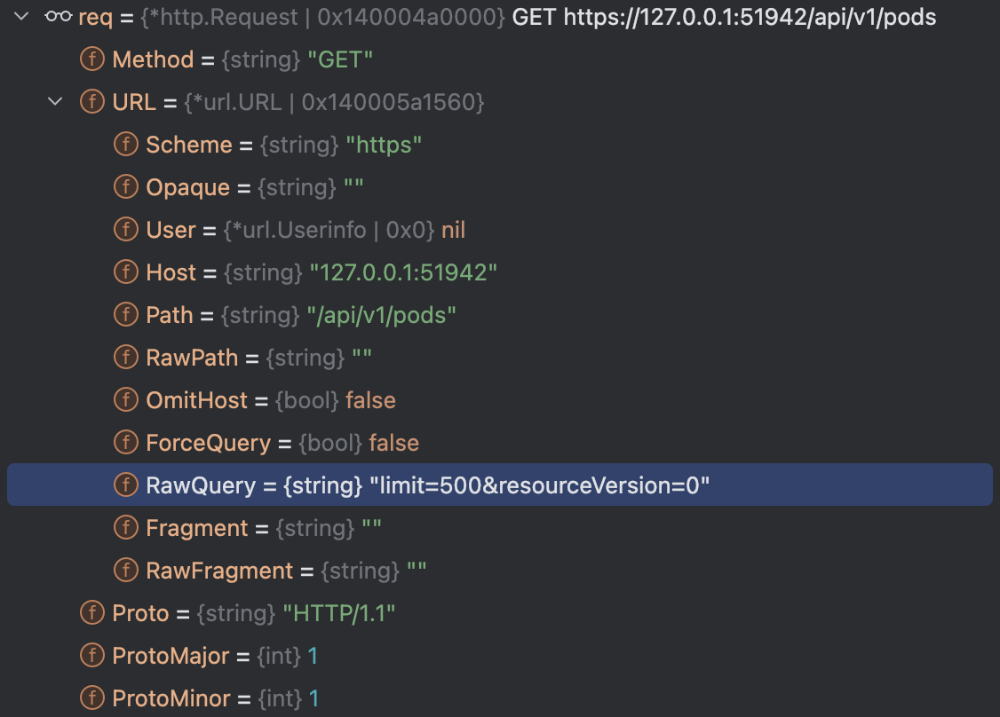
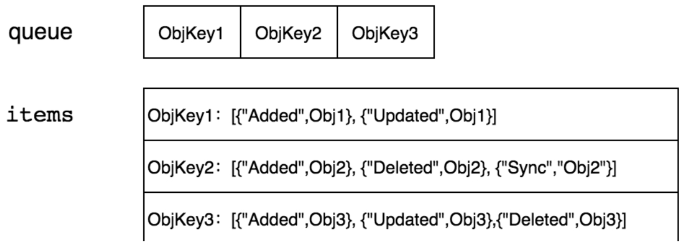

# 1. 介绍

**client-go 架构**


通过 client-go 可以实现访问 kubernetes 资源的实时性，可靠性和顺序性。那么 client-go 是
如何实现的呢？

# 2. list & watch

client-go 通过 list&watch 机制实现实时访问 kubernetes 资源，满足实时性。接下来从源码层面解析 client-go 的 list& watch 机制。

## 2.1 list 机制

client-go 的 list& watch 实现在 [tools/cache/reflect.go](https://github.com/kubernetes/client-go/blob/master/tools/cache/reflector.go)
中定义:

```aiignore
func (r *Reflector) ListAndWatch(stopCh <-chan struct{}) error {
	...
	if useWatchList {
		...
	}

        // 首次运行 client-go fallbackToList 为 true
	if fallbackToList {
	        // 调用 Refelector.list 方法实现 list kubernetes 资源
		err = r.list(stopCh)
		if err != nil {
			return err
		}
	}

	// list 之后接着执行 watch 同步资源信息
	return r.watchWithResync(w, stopCh)
}
```

`Reflector.list` 方法实现如下：
```aiignore
func (r *Reflector) list(stopCh <-chan struct{}) error {
        // 设置 resourceVersion 
	var resourceVersion string
	options := metav1.ListOptions{ResourceVersion: r.relistResourceVersion()}

	...
	go func() {
		...
		// Attempt to gather list in chunks, if supported by listerWatcher, if not, the first
		// list request will return the full response.
		pager := pager.New(pager.SimplePageFunc(func(opts metav1.ListOptions) (runtime.Object, error) {
		        // 调用 Reflector.listerWatcher 的 List 方法 list 资源
			return r.listerWatcher.List(opts)
		}))
                ...

                // 通过分页器 list 资源
		list, paginatedResult, err = pager.ListWithAlloc(context.Background(), options)
		// 处理出错的情况：
		if isExpiredError(err) || isTooLargeResourceVersionError(err) {
                    ...
		}
		close(listCh)
	}()
	select {
	case <-stopCh:
		return nil
	case r := <-panicCh:
		panic(r)
	case <-listCh:
	}

	r.setIsLastSyncResourceVersionUnavailable(false) // list was successful
	listMetaInterface, err := meta.ListAccessor(list)
	if err != nil {
		return fmt.Errorf("unable to understand list result %#v: %v", list, err)
	}
	
	// 获取 list 资源的 resource version
	// 该 resouce version 为资源最新的 resource version
	resourceVersion = listMetaInterface.GetResourceVersion()
	
	// 提取 list 资源信息到 items 中 
	items, err := meta.ExtractListWithAlloc(list)
	if err != nil {
		return fmt.Errorf("unable to understand list result %#v (%v)", list, err)
	}
	
	// 同步资源信息到 DeltaFIFO 中
	if err := r.syncWith(items, resourceVersion); err != nil {
		return fmt.Errorf("unable to sync list result: %v", err)
	}
	
	initTrace.Step("SyncWith done")
	// 更新 Reflector 的 resource version 
	r.setLastSyncResourceVersion(resourceVersion)
	initTrace.Step("Resource version updated")
	return nil
}
```

Reflector.list 的实现是比较清晰的，主要包括：  

- resourceVersion：设置 resourceVersion，满足实时性和顺序性的要求。
- 分页器访问资源：通过 pager 分页器访问资源，实际调用的是 `Reflector.listerWatcher.List(opts)` 方法。
- 同步到 DeltaFIFO: Reflect 作为生产者将资源同步到 DeltaFIFO 队列中。

这里为了介绍更详实，分别重点介绍上述主要实现。

### 2.1.1 resource version

`Reflector.relistResourceVersion` 初始化 `resource version`:

```aiignore
// relistResourceVersion determines the resource version the reflector should list or relist from.
// Returns either the lastSyncResourceVersion so that this reflector will relist with a resource
// versions no older than has already been observed in relist results or watch events, or, if the last relist resulted
// in an HTTP 410 (Gone) status code, returns "" so that the relist will use the latest resource version available in
// etcd via a quorum read.
func (r *Reflector) relistResourceVersion() string {
	r.lastSyncResourceVersionMutex.RLock()
	defer r.lastSyncResourceVersionMutex.RUnlock()

        // 如果 sync 资源版本不可用，则将 resource version 设置成 "" 
	if r.isLastSyncResourceVersionUnavailable {
		// Since this reflector makes paginated list requests, and all paginated list requests skip the watch cache
		// if the lastSyncResourceVersion is unavailable, we set ResourceVersion="" and list again to re-establish reflector
		// to the latest available ResourceVersion, using a consistent read from etcd.
		return ""
	}
	
	// 如果上一次同步的资源版本为 ""，则将 resource version 设置成 "0"
	// 上一次同步的资源版本为 "" 表示首次 list，否则 list 的上一次同步资源版本应该是资源的 resource version
	if r.lastSyncResourceVersion == "" {
		// For performance reasons, initial list performed by reflector uses "0" as resource version to allow it to
		// be served from the watch cache if it is enabled.
		return "0"
	}
	
	// 根据上一次的资源版本继续 list，设置 resource version 的资源版本为上一次的资源版本
	return r.lastSyncResourceVersion
}
```

设置 `resource version` 为 "" 将从 etcd 中获取资源信息，如果为 "0" 则从 APIServer 的缓存中获取资源的缓存信息，减轻 `etcd` 的访问压力。

设置 `resource version` 有点类似于“断点续传”，如果在 list 时没办法全部 list 完则记录这次最新的资源 `resource version` 在下一次的时候拿着这个 `resource version`
在去 list 剩下的。

### 2.1.2 分页器

分页器的实现在 `ListPager.list`：
```
func (p *ListPager) list(ctx context.Context, options metav1.ListOptions, allocNew bool) (runtime.Object, bool, error) {
    // 设置 Limit
    // Limit 是单次 list 所能获取的最多资源条目，默认 500
    if options.Limit == 0 {
        options.Limit = p.PageSize
    }
    requestedResourceVersion := options.ResourceVersion
    requestedResourceVersionMatch := options.ResourceVersionMatch

    var list *metainternalversion.List
    paginatedResult := false
	for {
		// 实际调用的是 Reflector.listerWatcher.List 方法
		obj, err := p.PageFn(ctx, options)
		if err != nil {
		        // 处理 list 出错的情况：
			...
		}

                // 如果资源全部 list 完，不需要在分页，返回
		// if we have no more items, return the list
		if len(m.GetContinue()) == 0 {
			return list, paginatedResult, nil
		}

                // 如果资源没有 list 完，获取下一次 list 的 Continue
		// set the next loop up
		options.Continue = m.GetContinue()
		// Clear the ResourceVersion(Match) on the subsequent List calls to avoid the
		// `specifying resource version is not allowed when using continue` error.
		// See https://github.com/kubernetes/kubernetes/issues/85221#issuecomment-553748143.
		options.ResourceVersion = ""
		options.ResourceVersionMatch = ""
		// At this point, result is already paginated.
		paginatedResult = true
	}
}
```

分页器的重点在于 options 的 Limit 和 Continue 这两个属性，具体的信息可参考 [kubernetes api reference](https://kubernetes.io/docs/reference/generated/kubernetes-api/v1.23/#podlist-v1-core)

在访问 APIServer 时带上这两个属性，流程如下：
```aiignore
1. 首先 `pager.list` 调用 `Reflector.ListerWatcher.list` 方法
func (lw *ListWatch) List(options metav1.ListOptions) (runtime.Object, error) {
	// 实际调用的是 ListFunc 方法
	return lw.ListFunc(options)
}

2. ListFunc 实现
func NewFilteredPodInformer(client kubernetes.Interface, namespace string, resyncPeriod time.Duration, indexers cache.Indexers, tweakListOptions internalinterfaces.TweakListOptionsFunc) cache.SharedIndexInformer {
	return cache.NewSharedIndexInformer(
		&cache.ListWatch{
		        // ListFunc 是提前注入的 
			ListFunc: func(options metav1.ListOptions) (runtime.Object, error) {
				// 实际通过客户端 client 访问 apiserver
				return client.CoreV1().Pods(namespace).List(context.TODO(), options)
			},
			...
		},
		&apicorev1.Pod{},
		resyncPeriod,
		indexers,
	)
}
```

构造的 URL 如下图所示：


可以通过一个简单的[示例程序](https://github.com/TroyXia/go-by-example/blob/main/client-go/list/main.go) 查看 limit 和 continue 是如何协同，实现资源分页的。

### 2.1.3 同步 DeltaFIFO

拿到资源之后需要同步该资源到 DeltaFIFO。同步的实现在 `Reflector.syncWith` 方法：
```aiignore
func (r *Reflector) syncWith(items []runtime.Object, resourceVersion string) error {
	found := make([]interface{}, 0, len(items))
	for _, item := range items {
		found = append(found, item)
	}
	// 将资源同步到 Reflector 的 DeltaFIFO 中
	return r.store.Replace(found, resourceVersion)
}

// 实际调用的是 DeltaFIFO.replace 方法，具体实现略
func (f *DeltaFIFO) Replace(list []interface{}, _ string) error {
	...
}
```

DeltaFIFO 的结构如下图所示：


其中，queue 表示按顺序进入队列的资源 key，items 记录的是 key 所对应的资源和行为（Delta）。

为什么需要这样的队列，直接用普通队列将资源 push 到普通队列中不行吗？主要原因在于上层处理逻辑（controller）需要根据不同的
资源变化执行相应的动作。如对于 Added 变化，controller 增加资源到缓存，对于 Updated 变化，更新资源到缓存，对于 Deleted 变化，
删除缓存中的资源。引入 Delta 可以实现，本地 client-go 缓存和 ETCD 的实时一致。保持实时性，避免资源重复。


## 2.2 watch 机制

list，更新 resource version 之后将进入 watch 的处理。源码在 `Reflector.watch` 方法：
```aiignore
func (r *Reflector) watch(w watch.Interface, stopCh <-chan struct{}, resyncerrc chan error) error {
	...
	for {
		...
		// start the clock before sending the request, since some proxies won't flush headers until after the first watch event is sent
		start := r.clock.Now()

		if w == nil {
			...
            // 调用 client 的 watch 方法
            // APIServer 将更新的资源回写到 w 中
			w, err = r.listerWatcher.Watch(options)
			if err != nil {
				...
			}
		}

                // 处理 watch 事件 
		err = handleWatch(start, w, r.store, r.expectedType, r.expectedGVK, r.name, r.typeDescription, r.setLastSyncResourceVersion,
			r.clock, resyncerrc, stopCh)
		...
		}
	}
}
```

经过层层调用，最终将 watch 到的事件交由 `handleAnyWatch` 函数处理：
```aiignore
func handleAnyWatch(...) (bool, error) {
...
loop:
	for {
		select {
		// stop 通道，负责处理 stop 信号
		case <-stopCh:
			return watchListBookmarkReceived, errorStopRequested
		// err 通道，负责处理 watch 的 err 
		case err := <-errCh:
			return watchListBookmarkReceived, err
		// apiserver 将资源变更写到 w.ResultChan 通道
		case event, ok := <-w.ResultChan():
		    ...
		    // 获取变更资源的 resource version
		    resourceVersion := meta.GetResourceVersion()
		    // 获取变更资源的更新类型
			switch event.Type {
			// 如果是新增资源
			case watch.Added:
			        // 将资源添加到 store 中，store 实际是 DeltaFIFO
				err := store.Add(event.Object)
				if err != nil {
					utilruntime.HandleError(fmt.Errorf("%s: unable to add watch event object (%#v) to store: %v", name, event.Object, err))
				}
			case watch.Modified:
			        // 更新 store 的资源 
				err := store.Update(event.Object)
				if err != nil {
					utilruntime.HandleError(fmt.Errorf("%s: unable to update watch event object (%#v) to store: %v", name, event.Object, err))
				}
			case watch.Deleted:
				// TODO: Will any consumers need access to the "last known
				// state", which is passed in event.Object? If so, may need
				// to change this.
				err := store.Delete(event.Object)
				if err != nil {
					utilruntime.HandleError(fmt.Errorf("%s: unable to delete watch event object (%#v) from store: %v", name, event.Object, err))
				}
				...
			}
			// 更新 Reflector 的 resource version 为 watch 的资源 resource version
			setLastSyncResourceVersion(resourceVersion)
			...
		}
	}
}
```

watch 调用 client 的 watch 方法，和 APIServer 建立长链接。APIServer 将资源的变更信息（包括变更类型和资源）写到
`w.ResultChan` 通道。在 Reflector 的 `handleAnyWatch` 中对通道中的变更信息做相应的处理。

以 `watch.Deleted` 删除变更类型看是如何处理的：
```aiignore
// 实际 store.Delete 调用的是 DeltaFIFO.Delete 方法
func (f *DeltaFIFO) Delete(obj interface{}) error {
    // 获取对象的 key，key 是 namespace/name 形式
	id, err := f.KeyOf(obj)
	if err != nil {
		return KeyError{obj, err}
	}
	...
	// 重点在 DeltaFIFO.queueActionLocked 方法
	// exist in items and/or KnownObjects
	return f.queueActionLocked(Deleted, obj)
}

func (f *DeltaFIFO) queueActionLocked(actionType DeltaType, obj interface{}) error {
    // 调用 DeltaFIFO.queueActionInternalLocked 方法
	return f.queueActionInternalLocked(actionType, actionType, obj)
}

func (f *DeltaFIFO) queueActionInternalLocked(actionType, internalActionType DeltaType, obj interface{}) error {
	// 获取资源对象的 key
	id, err := f.KeyOf(obj)
	if err != nil {
		return KeyError{obj, err}
	}
	...
	oldDeltas := f.items[id]
	newDeltas := append(oldDeltas, Delta{actionType, obj})
	newDeltas = dedupDeltas(newDeltas)
	
	if len(newDeltas) > 0 {
	        // 判断 DeltaFIFO.items 中是否存在资源 
		if _, exists := f.items[id]; !exists {
		    // 如果不存在则将资源的 key 存入 Delta.queue 中
			f.queue = append(f.queue, id)
		}
		// 不管资源存不存在，更新 DeltaFIFO.items 
		f.items[id] = newDeltas
		// Reflector 作为生产者通知下游的消费者退出阻塞
		f.cond.Broadcast()
	} else {
	    ...
	}
	return nil
}
```

watch 主要是将变更的资源根据类型记录到 DeltaFIFO 中，并且通知下游的消费者开始处理资源。

# 3. 异常处理

Reflector 的 list&watch 机制到此就差不多介绍完了。这是 list&watch 的正常逻辑，如果出现异常，比如执行 list&watch 时 apiserver 不可用，
此时 client-go（Reflector） 会如何处理呢？

接下来，假设 watch 资源时 apiserver 不可用。查看 watch 源码分析异常处理逻辑。

## 3.1 retry

watch 的异常处理在 `Reflector.watch` 
```aiignore
func (r *Reflector) watch(w watch.Interface, stopCh <-chan struct{}, resyncerrc chan error) error {
	var err error
	...
	    // handleWatch 正常状态下是不会退返回的
        err = handleWatch(start, w, r.store, r.expectedType, r.expectedGVK, r.name, r.typeDescription, r.setLastSyncResourceVersion,
            r.clock, resyncerrc, stopCh)

        // 如果返回，停止 watch
        w.Stop()
        w = nil

        // 设置下次重试时间
        retry.After(err)
        if err != nil {
            // 判断是否是 stop request 错误
            // 如果是，退出 watch。否则，进入 switch 判断错误类型
            if !errors.Is(err, errorStopRequested) {
                switch {
                // 如果是资源过期错误，则重新进入循环
                case isExpiredError(err):
                    // Don't set LastSyncResourceVersionUnavailable - LIST call with ResourceVersion=RV already
                    // has a semantic that it returns data at least as fresh as provided RV.
                    // So first try to LIST with setting RV to resource version of last observed object.
                    klog.V(4).Infof("%s: watch of %v closed with: %v", r.name, r.typeDescription, err)
                // 处理 too many requests 错误
                case apierrors.IsTooManyRequests(err):
                    klog.V(2).Infof("%s: watch of %v returned 429 - backing off", r.name, r.typeDescription)
                    select {
                    // 如果 stopCh 有消息，则退出 watch
                    case <-stopCh:
                        return nil
                    // 如果 backoff 通道有消息，则重新运行 watch
                    // 这个应该是和 retry.After(err) 有关系的
                    case <-r.backoffManager.Backoff().C():
                        continue
                    }
                // 如果 internal error 和 should retry 为 true 的话，重新运行 watch
                case apierrors.IsInternalError(err) && retry.ShouldRetry():
                    klog.V(2).Infof("%s: retrying watch of %v internal error: %v", r.name, r.typeDescription, err)
                    continue
                // 默认打印 Warning 并退出 watch
                default:
                    klog.Warningf("%s: watch of %v ended with: %v", r.name, r.typeDescription, err)
                }
            }
            return nil
        }
    }
```

watch 如果出错的话，会根据错误类型判断是重新运行 watch 还是退出 watch。如果退出 watch 下次会重新运行吗？

继续看 client-go 的指数退避实现。

## 3.2 指数退避

client-go 的指数退避在 `Reflector.Run` 方法中实现：
```aiignore
func (r *Reflector) Run(stopCh <-chan struct{}) {
	klog.V(3).Infof("Starting reflector %s (%s) from %s", r.typeDescription, r.resyncPeriod, r.name)
	// 调用 wait.BackoffUntil 在 func() 退出时重试
	wait.BackoffUntil(func() {
		if err := r.ListAndWatch(stopCh); err != nil {
			r.watchErrorHandler(r, err)
		}
	}, r.backoffManager, true, stopCh)
	klog.V(3).Infof("Stopping reflector %s (%s) from %s", r.typeDescription, r.resyncPeriod, r.name)
}
```

具体的指数退避策略定义在 `Reflector.backoffManager` 中，定义如下：
```aiignore
func NewReflectorWithOptions(lw ListerWatcher, expectedType interface{}, store Store, options ReflectorOptions) *Reflector {
	...
	r := &Reflector{
		...
		// We used to make the call every 1sec (1 QPS), the goal here is to achieve ~98% traffic reduction when
		// API server is not healthy. With these parameters, backoff will stop at [30,60) sec interval which is
		// 0.22 QPS. If we don't backoff for 2min, assume API server is healthy and we reset the backoff.
		backoffManager:    wait.NewExponentialBackoffManager(800*time.Millisecond, 30*time.Second, 2*time.Minute, 2.0, 1.0, reflectorClock),
	}
    ...
}
```

`wait.NewExponentialBackoffManager` 创建 backoffManager。其中定义初始重试时间为 800ms，最大重试时间 30s，每 2m 重置一次重试时间
重试的指数因子为 2.0，干扰因子 jitter 1.0。

采用指数退避算法，Reflector 的 list&watch 机制是不会退出的。

# 4. 思考

- 为什么 list&watch 可以实现实时性？

根据上文分析，list&watch 通过 list 获取资源，watch 更新资源变化的方式，实现资源的实时更新。

并且，watch 采用的是 http/2 流式传输实现数据的实时传输，对于 http/1.1 APIServer 采用 http trunked 传输来保证
数据传输的实时性。

这一点并未在本文体现，有兴趣的读者可以查看 watch 的返回包中的字段深入了解。相应的代码示例
可以参考 [watch](https://github.com/TroyXia/go-by-example/blob/main/http/watch/main.go)。

- 不用 DeltaFIFO 直接拿 Reflector list&watch 的资源信息处理行不行？

不行。  
首先业务逻辑处理相对 list&watch 的处理速度是比较慢的，如果直接处理可能导致业务逻辑无法及时响应
造成资源信息丢失或者拥塞。

直接处理没有缓存，如果业务逻辑需要拿资源信息还得通过 list&watch 拿，或者通过 APIServer 拿数据，造成资源浪费。

耦合性太强，DeltaFIFO 是和 APIServer 打交道的组件，如果既和 APIServer 交互，又和业务逻辑打交道，会使得耦合性太强，
不够专注，逻辑混乱。

无法合并重复变化，处理最新的资源变化，资源可能在短时间内有大量变更状态，如果直接将资源丢给业务逻辑，业务逻辑
无法判断资源是什么状态，会对每次变更做处理，反而没时间处理最新的应该处理的变更，而导致做了很多无用功，造成资源浪费。

- 从 list&watch 设计可以学到什么？

1）wait 包是一个好东西，通过 wait 包结合指数退避可以实现程序的重试，并且不会造成重试拥堵问题。  
2）`wg.StartWithChannel` 开启一个协程运行程序的方式比较优雅，这个也可以用起来。
3） 指数退避是最后的屏障，如果在启用前，可以先判断是否可以 retry。  
4）队列不止只有普通队列，DeltaFIFO 就是围绕业务场景设计的队列，很优雅。
5） Reflector 通过 list&watch 实现实时性的要求，通过 retry 和指数退避实现可靠性的要求。这在构造类似应用时可以用上。

# 5. 参考文章

- [client-go中watch机制的一些陷阱](https://blog.csdn.net/weixin_43583163/article/details/145020079)
- [2022年最新k8s编程operator篇](https://www.bilibili.com/video/BV1Gb4y177WE?spm_id_from=333.788.videopod.sections&vd_source=9df4c2c634be18cd54aa187cff2f4335)
- [Kubernetes源码剖析](https://book.douban.com/subject/35100082/)
- [Kubernetes Operator 开发进阶](https://www.cnblogs.com/daniel-hutao/p/advanced_kubernetes_operator.html)
