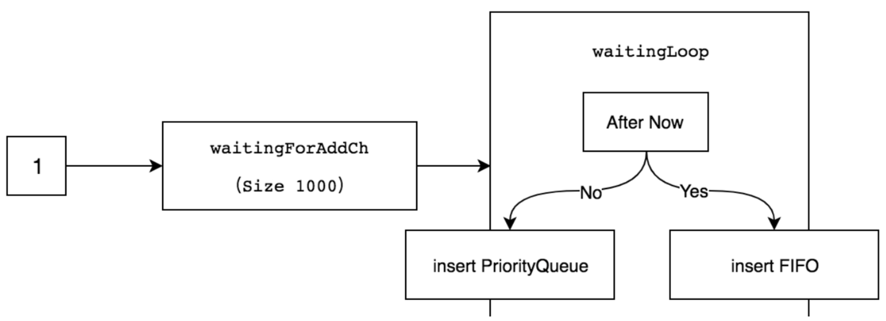

# 1. 介绍

传递到 event handler 的资源一般不会立即处理，而是先放到 workqueue 中。这是因为业务的处理速度要比资源的更新速度慢。
通过 workqueue 可解耦业务的处理逻辑和资源更新逻辑。

具体的说，`processor` 负责将待处理的资源加入到 workqueue 中，业务逻辑负责从 workqueue 中取资源并且处理。

workqueue 底层采用延迟队列实现。在 `client-go/util/workqueue` 中定义了 client-go 的 workqueue 实现。

`client-go/util/workqueue` 有 FIFO 队列，延迟 workqueue 和 限速 workqueue 实现。

## 2. FIFO 队列

FIFO workqueue 在普通队列基础上实现了标记，去重。其结构如下：
```aiignore
type Typed[t comparable] struct {
	// 实际存储元素的队列，保证元素处理的有序性
	queue Queue[t]

	// 用于去重，保证并发唯一性
	dirty set[t]

	// 用于标记元素是否正在处理，具有唯一性
	processing set[t]
}
```

`queue`, `dirty` 和 `processing` 是非常重要的结构，`queue` 实现为队列，用于存储资源（通常是资源的 key），
`dirty` 用于去重，如果 dirty 中已经有数据了则不添加数据到 `queue`,`processing` 用于标记当前正在处理的资源。

`dirty` 和 `processing` 为 hash map 实现，具有唯一性。

如下图所示为一个正常的资源处理流程：


假设在并发场景下，如果业务逻辑在处理资源 1(key: 1)，此时 1 资源做了更新，那么业务逻辑正在处理的资源实际是旧资源。

这时候 FIFO workqueue 的处理流程如下：  


# 3. 延迟队列

延迟队列基于 FIFO 队列，通过引入延迟时间和堆实现队列的延迟。

首先，将资源的延迟时间和 key 通过通道传递到 `waitingForAddCh` 通道。接着 `waitingLoop` 将从 `waitingForAddCh`
中取数据。

如果资源未到延迟时间，则将资源存入最小堆 `waitForPriorityQueue`，最小堆按照资源的延迟时间排序，实现如下：
```aiignore
func (pq waitForPriorityQueue[T]) Len() int {
	return len(pq)
}
func (pq waitForPriorityQueue[T]) Less(i, j int) bool {
	return pq[i].readyAt.Before(pq[j].readyAt)
}
func (pq waitForPriorityQueue[T]) Swap(i, j int) {
	pq[i], pq[j] = pq[j], pq[i]
	pq[i].index = i
	pq[j].index = j
}
```

如果资源达到延迟时间，则将资源存入 FIFO 队列。

示意图如下：


# 4. 限速队列

限速队列是在延迟队列基础上，通过引入限速算法确定延迟时间的方式实现限速。

client-go 使用四种限速算法实现限速，分别是排队指数算法，计数器算法，令牌桶算法和混合模式。

## 4.1 排队指数算法

排队指数算法是对同一元素实现限速延迟的算法。如果同一元素在限速周期内被重复加入，则会触发排队。

其核心实现在：
```aiignore
func (r *TypedItemExponentialFailureRateLimiter[T]) When(item T) time.Duration {
	r.failuresLock.Lock()
	defer r.failuresLock.Unlock()

        // 查看元素是否在限速周期内
	exp := r.failures[item]
	// 如果在将元素的 failures + 1
	r.failures[item] = r.failures[item] + 1

        // 指数算法确定元素的延迟入队时间 
	backoff := float64(r.baseDelay.Nanoseconds()) * math.Pow(2, float64(exp))
	// 如果该时间大于 math.MaxInt64，则设置延迟入队时间为 maxDelay
	if backoff > math.MaxInt64 {
		return r.maxDelay
	}

        // 如果计算的时间大于  maxDelay 则设置延迟入队时间为 maxDelay
	calculated := time.Duration(backoff)
	if calculated > r.maxDelay {
		return r.maxDelay
	}

	return calculated
}
```

可以看到这里排队指数使用属性 `failures` 记录元素的排队时间，这是因为排队指数算法常用在失败重试的场景下。
通过指数计算下次处理的时间，避免频繁重试对系统造成冲击。

## 4.2 计数器算法

计数器算法限制一段时间内允许通过的元素数量。

计数器算法实现如下：
```aiignore
func (r *TypedItemFastSlowRateLimiter[T]) When(item T) time.Duration {
	r.failuresLock.Lock()
	defer r.failuresLock.Unlock()

	r.failures[item] = r.failures[item] + 1

	if r.failures[item] <= r.maxFastAttempts {
		return r.fastDelay
	}

	return r.slowDelay
}
```

假设 fastDelay 是 5ms，slowDelay 是 10s，
maxFastAttempts 是 3。在一个限速周期内通过 AddRateLimited 方法插入 4 个相同的元素，
那么前 3 个元素使用 fastDelay 定义的 fast 速率，当触发 maxFastAttempts 字段时，第 4 个元素使用 slowDelay 定义的 slow 速率。

> client-go 实现的计数器算法对普通计算器算法做了改造。普通计数器算法不针对同一元素，在元素数量
> 达到阈值时，则切换延迟时间来控制请求速率，防止请求过多占用过多资源。

 ## 4.3 令牌桶算法

令牌桶算法的实现在 `golang.org/x/time/rate` 库中定义。

令牌桶算法内部实现了一个存放 token（令牌）的“桶”，初始时“桶”是空的，token 会以固定速率往“桶”里填充，直到将其填满为止，
多余的 token 会被丢弃。每个元素都会从令牌桶得到一个 token，令牌桶算法内部实现了一个存放 token（令牌）的“桶”，初始时“桶”是空的，
token 会以固定速率往“桶”里填充，直到将其填满为止，多余的 token 会被丢弃。每个元素都会从令牌桶得到一个 token，

在实例化 rate.NewLimiter 后，传入 r 和 b 两个参数，其中 r 参数表示每秒往“桶”里填充的 token 数量，b 参数表示令牌桶的大小
（即令牌桶最多存放的 token 数量）。

假定 r 为 10，b 为 100。假设在一个限速周期内插入了 1000 个元素，通过 `r.Limiter.Reserve().Delay` 函数返回指定元素应该等待的时间，
那么前 b（即 100）个元素会被立刻处理，而后面元素的延迟时间分别为 item100/100ms、item101/200ms、item102/300ms、item103/400ms，以此类推。

## 4.4 混合模式

混合模式是将多种限速算法混合使用，比较获取最大延迟时间来限速的模式。

示例如下：
```aiignore
func TestMaxOfRateLimiter(t *testing.T) {
        // 混合排队指数算法和计数器算法
	limiter := NewMaxOfRateLimiter(
		NewItemFastSlowRateLimiter(5*time.Millisecond, 3*time.Second, 3),
		NewItemExponentialFailureRateLimiter(1*time.Millisecond, 1*time.Second),
	)

        // 确定延迟时间
	if e, a := 5*time.Millisecond, limiter.When("one"); e != a {
		t.Errorf("expected %v, got %v", e, a)
	}
	...
}
```

# 5. 小结

资源采用限速队列的方式加入到 workqueue 中，最后由上层业务逻辑进行处理。在实际开发中，使用哪种限速队列对我们也是有意义的。

```
在实际应用中，选择限速队列算法需综合考虑多方面因素：

流量特征
- 突发流量：若流量具有明显的突发性质，如短时间内有大量请求集中到达，令牌桶算法是较好的选择，它能在限制平均流量的同时，允许一定程度的突发处理。
- 平稳流量：对于流量相对平稳、速率变化不大的场景，计数算法较为合适，可精确控制请求速率，实现简单且能有效防止系统过载。

任务性质
- 重试策略：当任务需要根据重试次数动态调整等待时间，如一些涉及资源竞争或可能导致系统不稳定的操作，排队指数算法能通过指数增长的等待时间，避免频繁重试对系统造成冲击。
- 时效性要求：若任务对时效性要求极高，不允许有较大的延迟，令牌桶算法或计数算法更优，因为排队指数算法可能因指数增长的等待时间而导致任务处理延迟较大。

系统资源
- 资源有限：在系统资源紧张，如 CPU、内存有限的情况下，计数算法由于实现简单，对资源的消耗相对较小，是一个可行的选择。令牌桶算法虽然实现稍复杂，但能有效利用资源应对突发流量，在资源允许的情况下也可考虑。
- 资源充足：如果系统资源较为充足，可更多地考虑算法对流量控制的精确性和灵活性。此时，令牌桶算法是不错的选择，能在保证系统稳定的同时，充分利用资源处理突发流量。

业务需求
- 精度要求：某些业务场景对请求速率的控制精度要求极高，如金融交易系统，此时计数算法可精确限制每秒请求数量，满足高精度控制需求。
- 业务逻辑复杂：若业务逻辑复杂，涉及多种不同类型的任务和处理流程，可能需要综合考虑多种算法，或者根据不同的任务类型选择不同的算法。例如，对于一些关键且不允许丢失的任务，可以使用令牌桶算法保证其在突发情况下也能得到及时处理；对于一些可重试的非关键任务，可以采用排队指数算法来控制重试频率。
```

实际的场景案例如下：
```aiignore
以下以 Kubernetes 集群中节点与 API Server 的通信场景为例，说明如何选择合适的算法：
场景描述
- Kubernetes 集群中有多个节点，这些节点会定期向 API Server 发送心跳信息以汇报自身状态，同时会在资源发生变化时向 API Server 发送更新请求。

流量特征分析
- 心跳信息的发送频率相对稳定，属于平稳流量。而资源更新请求可能会因为某些操作（如大规模应用部署）而出现突发流量。

任务性质分析
- 心跳信息要求时效性高，不能有较大延迟，以保证 API Server 能及时了解节点状态。资源更新请求如果失败，需要有合理的重试策略，避免对系统造成过大压力。

系统资源分析
- 节点的 CPU 和内存资源有限，需要考虑算法对资源的消耗。

业务需求分析
- 对于心跳信息，要求对发送速率有严格控制，以避免过度占用网络带宽和 API Server 资源。对于资源更新请求，要能在保证系统稳定的前提下，尽可能快速地处理突发的更新任务。

算法选择
- 对于心跳信息的限速，由于流量平稳且对速率控制精度要求高，选择计数算法。可以设置每秒允许发送一定数量的心跳请求，精确控制请求速率，防止因心跳请求过多占用过多资源。
- 对于资源更新请求，考虑到存在突发流量和任务的重试需求，选择令牌桶算法结合排队指数算法。令牌桶算法用于处理突发的资源更新请求，允许在一定时间内有较多的请求被处理，以应对大规模应用部署等情况。当更新请求失败时，采用排队指数算法进行重试，随着重试次数增加，等待时间逐渐变长，避免频繁重试对系统造成冲击。
```

